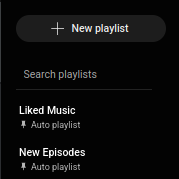
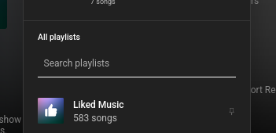

# Playlist Searcher for YouTube Music

**YouTube Music** is a great music streaming service, but it's missing an easy way to search for your playlists. This extension solves that problem by adding a search bar to YouTube Music.

You can use it to search for playlists by name in two places: the main sidebar and the "Add to Playlist" dialog.

**NOTE:** _This is the first version of the extension and might not work as expected. It is possible that the way elements are observed is too heavy on the browser and will have to be optimized._

## Screenshots

# TODO

- [ ] Optimize the way elements are observed (as it might be too heavy now)
- [ ] Add word-based search that works regardless of word order (e.g. "90s pop" will find "Pop - 90s")