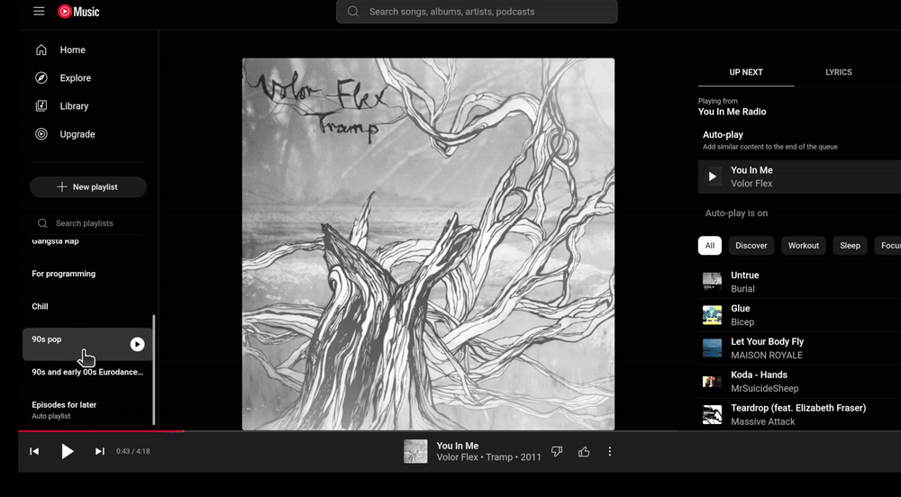
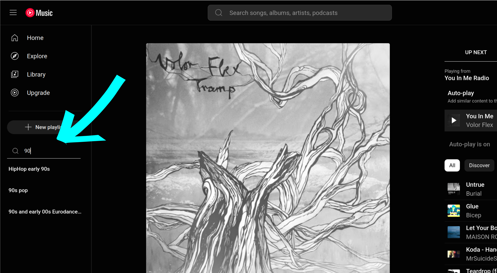
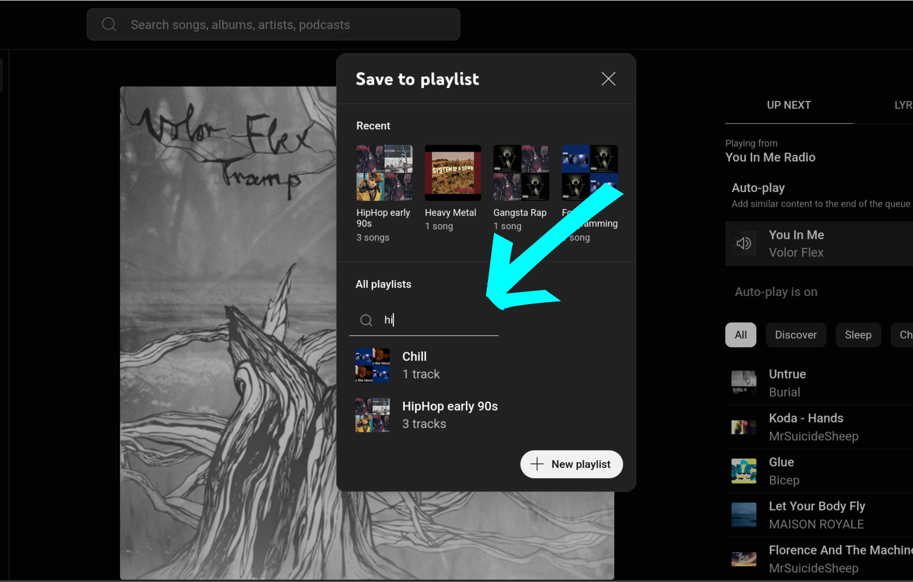

  

# Playlist Searcher for YouTube Music

**YouTube Music** is a great music streaming service, but it's missing an easy way to search through your playlists. This unofficial extension solves that problem by adding a search bar to the YouTube Music website.

You can use it to search for playlists by name in two places: the main sidebar and the "Add to Playlist" dialog.

**NOTE:** _This is an early version of the extension and may not work as expected. The current method for monitoring page elements could be resource-intensive and will require future optimization._

### Video

<table>
  <tr>
    <td></td>
  </tr>
</table>

### Screenshots
<table>
  <tr>
    <td></td>
    <td></td>

  </tr>
</table>

# TODO

- [ ] Optimize the way elements are observed (as it might be too heavy now)
- [ ] Add word-based search that works regardless of word order (e.g. "90s pop" will find "Pop - 90s")